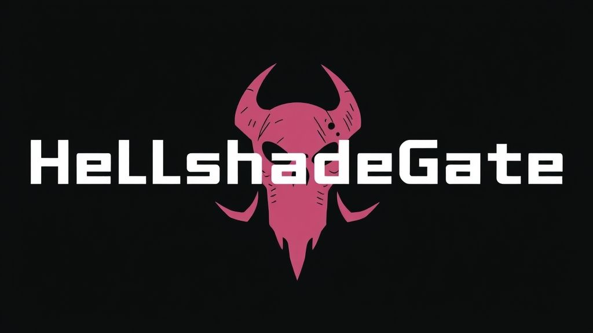

# 🚀 HellshadeGate - Direct Syscall Loader for Windows

## 🧩 Project Overview

HellshadeGate is a modular Rust loader that demonstrates advanced Windows offensive techniques, including direct syscalls, dynamic syscall resolution, and shellcode execution. The project is designed for red team operations, malware research, and security testing.

---

## �️ Technical Architecture

### 1. Direct Syscalls (Hellsgate/BasicGate)
- The loader uses a custom x64 assembly stub (`src/hellsgate.asm`) to invoke Windows syscalls directly, bypassing user-mode hooks and EDRs.
- The Rust FFI interface calls this stub, passing syscall numbers and arguments.

### 2. Dynamic Syscall Resolution
- At runtime, the loader parses the PE export directory of `ntdll.dll` to extract syscall numbers.
- The function in `src/pe/mod.rs` reads the export table, locates syscall stubs, and extracts the syscall ID from the first bytes of each function.
- A custom hash function (in `src/gate/mod.rs`) matches syscall names to avoid static string detection.

### 3. Modular Rust Codebase
- **src/gate/mod.rs**: Manages the syscall table, hash function, and FFI to the assembly stub.
- **src/pe/mod.rs**: Handles PE parsing and syscall extraction.
- **src/utils/mod.rs**: Provides helpers for module handle resolution and byte manipulation.
- **src/main.rs**: Orchestrates the loader logic, including shellcode decoding, memory allocation, protection changes, and thread creation.

### 4. Shellcode Loader Logic
- Reads base64-encoded shellcode from `shellcode.txt`.
- Allocates RWX memory using `NtAllocateVirtualMemory`.
- Writes shellcode using `NtWriteVirtualMemory`.
- Changes memory protection to executable with `NtProtectVirtualMemory`.
- Executes shellcode in a new thread via `NtCreateThreadEx`.
- All steps include debug output for validation and troubleshooting.

---
[demo en Streamable](https://streamable.com/jmepy4?src=player-page-share)
## 🧬 Code Flow

1. **Syscall Table Initialization**
  - On startup, the loader builds a syscall table by parsing `ntdll.dll` and resolving syscall numbers for required functions.

2. **Shellcode Preparation**
  - Shellcode is read from a file, decoded from base64, and stored in a buffer.

3. **Memory Allocation & Writing**
  - The loader allocates memory in the target process (itself), writes the shellcode, and sets the correct memory protection.

4. **Thread Creation**
  - A new thread is created at the shellcode entry point, executing the payload.

5. **Debugging**
  - Each step prints detailed debug information, including addresses, sizes, and error codes.

---

## 🛡️ Security Techniques

- **EDR/AV Evasion**: Direct syscalls bypass user-mode hooks and many security products.
- **Dynamic Analysis Resistance**: Syscall numbers are resolved at runtime, not hardcoded.
- **Modular Design**: New syscalls or loader features can be added easily.

---

## 📚 Usage Instructions

1. **Generate Shellcode**
  - Use `msfvenom` or similar tools to create x64 Windows shellcode.
  - Encode to base64 and save as `shellcode.txt`.

2. **Build the Project**
  - `cargo build --release`

3. **Run the Loader**
  - Place `shellcode.txt` in the same directory as the executable.
  - Run the binary and observe debug output.

---

## 📝 Example Shellcode Generation

```sh
msfvenom -p windows/x64/messagebox TITLE="Hello" TEXT="Hello World" -f raw -o helloworld.bin
base64 -w 0 helloworld.bin > shellcode.txt
```

---

## 👨‍💻 Authors & Credits

- Project by [kitsuneshade]
- Inspired by Hellsgate, sRDI, and modern red team tradecraft

---

## ⚠️ Disclaimer

This project is for educational and research purposes only. Use responsibly and only in environments where you have explicit permission.

---

## 🏷️ Tags

`Rust` `Windows` `Direct Syscalls` `EDR Evasion` `Shellcode Loader` `Red Team` `Malware Research`
